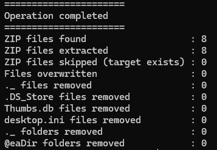

## How archives are processed

1. Archivist checks the archive, available space, and expansion ratio.
2. It extracts into a hidden sibling staging folder.
3. It restores the original timestamps stored in the ZIP.
4. It renames the staging folder and removes the ZIP unless `--leave-zip` is set.

A failed or interrupted extraction leaves the destination untouched. ZIP files found inside
extracted content are processed in the same run, up to ten levels deep.

## Metadata cleanup

After extraction, Archivist removes these items in order:

* AppleDouble `._*` files at or below the configured maximum size
* macOS `.DS_Store` files
* Windows `Thumbs.db` and `desktop.ini` files
* `._*` folders without visible content
* Synology `@eaDir` folders

Use the matching `--leave-*` option to preserve any category.

## Existing folders

If an archive destination already exists, interactive runs ask whether to extract into it:

```text
2024.zip: folder "2024" already exists. Extract into it and overwrite files with the same name? [y]es / [n]o / [a]ll / [s]kip all:
```

Extracting into an existing folder adds new files and replaces matching files. Other files remain
in place. Before anything moves, Archivist rejects links, junctions, file-versus-folder conflicts,
and read-only replacements unless `--force` is set.

:::{note}
Dry runs and non-interactive runs do not prompt. Existing destinations are reported and skipped.
:::

## Dry runs

A run stays in preview mode until `--apply` is passed or `ARCHIVIST_APPLY=true` is set. The report
file is the only file written during a dry run, unless logging is disabled.

```powershell
# Preview
archivist --parent-folder "C:\photos"

# Make the changes
archivist --parent-folder "C:\photos" --apply
```

## Reports

The console lists the active options, each action, and a count per step. The same report is appended
to `report.log` in the processed folder by default.



| Setting | Report destination |
|---|---|
| No option | `<parent-folder>/report.log` |
| `--log-file D:\logs\run.log` | The specified file |
| `--log-file D:\logs\` | `D:\logs\report.log` |
| `--no-log-file` | Console only |

## Common recipes

```powershell
# Send removed items to the Recycle Bin or Trash
archivist --parent-folder "C:\photos" --apply --send-to-bin

# Keep original archives
archivist --parent-folder "C:\photos" --apply --leave-zip

# Extract without metadata cleanup
archivist --parent-folder "C:\photos" --apply --leave-appledouble --leave-eadir --leave-ds-store --leave-thumbs-db --leave-desktop-ini

# Remove AppleDouble files up to 4 KB, including read-only files
archivist --parent-folder "C:\photos" --apply --max-size 4096 --force
```
