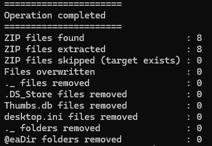

## Image inventory

```powershell
archivist --list-pictures --parent-folder "C:\photos" --filter JPG,Png,Jpeg,ARW
archivist --list-images --extract-zip --parent-folder "C:\photos" --dry-run
```

`pictures` and `images` are aliases. Listing scans ordinary files and ZIP entries,
including ZIPs inside ZIPs, without extracting files. An image is classified by its
extension, not its contents. The built-in catalog is:

```text
jpg jpeg png gif bmp tif tiff webp heic heif avif ico svg
arw cr2 cr3 nef nrw dng orf rw2 raf pef srw
```

`--filter` restricts that catalog. It accepts commas, case differences, surrounding
whitespace and leading dots, and removes duplicates. Empty entries and unsupported
extensions are errors, not wildcards or a fallback to all images.

Inventory rows contain the filename, normalized extension, full source location,
ordering timestamp and timestamp provenance. ZIP locations have the form
`C:\photos\outer.zip :: inner.zip :: album/photo.jpg`; those are archive members,
not claims that extracted files already exist. Counts distinguish on-disk images,
archived images, direct entries in each archive, and physical source folders.
Existing disk and archive copies count as separate occurrences; there is no
content deduplication.

Runs append separated sections to `<parent-folder>\pictures.log` and print its
absolute path. `--log-file` selects a different report and `--no-log-file` disables
it. Image workflows do not also create `report.log`. JSON rows escape filenames
and paths. Known AppleDouble/`@eaDir` metadata and filesystem links are excluded.
The report contains local paths: redact it before sharing publicly.

## Move and copy pictures

```powershell
# Listing, move preview and copy preview share the same inventory
archivist --move-pictures --parent-folder "C:\photos" --dry-run
archivist --move-pictures --copy --parent-folder "C:\photos" --dry-run

# Apply: list -> human approval -> complete ZIP extraction -> move
archivist --move-pictures --parent-folder "C:\photos" --destination "D:\collected" --apply

# Copy instead: leave original pictures and ZIPs unchanged
archivist --move-pictures --copy --parent-folder "C:\photos" --destination "D:\collected" --apply
```

Listing and extraction prerequisites are added once, regardless of explicit flags
or argument order. The filter selects pictures, not which other archive files are
extracted. No matching pictures means no extraction, destination creation or ZIP
deletion. Explicit image workflows never run metadata cleanup.

Before anything changes, the console lists counts, extension breakdown, physical
source-folder impact, mode, exact destination names, extraction locations and ZIP
disposal effects. Only `y` or `yes` approves. Blank input, EOF, refusal or no
interactive terminal prevents mutation. `--apply` and environment settings cannot
replace approval; `--dry-run` wins over `ARCHIVIST_APPLY=true`.

Listing alone stays read-only with `--apply`. Listing combined with
`--extract-zip --apply` follows **list -> approve -> extract**, without transfers.
Explicit extraction alone uses legacy extraction behavior without cleanup.

### Destinations and collision names

The destination is flat. Relative destinations resolve against the process's
current working directory, not the parent folder. Applying a transfer requires
one; preview does not. Neither source nor destination may contain the other.
Links/junctions and existing extraction targets are rejected; image workflows
never merge into an existing extraction folder.

Noncolliding pictures keep their names. Collisions are grouped case-insensitively,
and all incoming duplicates get numbered names, even when the bare name is free.
Existing files and incoming noncolliding names are reserved first. Available
suffixes are assigned oldest first, with at least three digits and no wrap after
999. For example, if `photo.jpg` and `photo (001).jpg` exist, the next two colliding
pictures receive `photo (002).jpg` and `photo (003).jpg`.

Ordering uses original creation/birth metadata where available, including ZIP NTFS
or extended Unix creation fields. Otherwise it uses original modification time
and labels that fallback in the report. Full source location breaks timestamp
ties. Extraction time, image capture time and POSIX metadata-change time are not
substitutes.

### Photo metadata and original dates

Image workflows copy picture bytes without decoding or rewriting them. Embedded
EXIF, including **DateTimeOriginal (date taken)**, digitization dates and camera
metadata, therefore remains unchanged. EXIF dates and filesystem dates are distinct:
Archivist never replaces one with the other.

Original filesystem modification time and available creation/birth time are
captured during inventory, restored after writing, and verified before a move
source or original ZIP can be removed. The report includes `creation_time_ns`
and `modification_time_ns` as UTC epoch nanoseconds; `null` means creation time
was unavailable, not inferred from modification time or EXIF.

For ZIP entries, Archivist checks local and central timestamp metadata. NTFS
timestamps preserve 100-nanosecond precision; extended Unix timestamps preserve
UTC seconds, including local-header-only creation dates. NTFS metadata takes
precedence over extended Unix metadata, then the ZIP's DOS modification time is
the fallback. DOS timestamps have two-second precision and no timezone, so they
use the current local timezone. Missing archive creation dates cannot be recovered:
the newly created file has an OS-assigned creation time, not an original one.

Windows has native creation-time restoration support. Linux may expose source
birth time without supporting its restoration, and some destination filesystems
round dates. **A known creation/modification date that
cannot be preserved causes an explicit failure**, not a silently changed date.
Original sources and not-yet-removed ZIPs are retained; earlier completed moves
are not undone. Use a destination/platform supporting the original timestamps.
Available access time is restored too, but subsequent reads and OS bookkeeping
can change it. POSIX `ctime` records metadata changes, not file creation, and is
not preserved. These guarantees apply to the image workflow; legacy extraction
alone retains its existing modification-time behavior.

### Extraction, preservation and failure

All relevant physical ZIPs and their nested ZIPs are fully extracted before the
first picture transfer. In move mode, extraction publishes to unused folders
beside the original ZIPs. Nonselected contents remain there, including nested ZIP
files. Only original physical ZIPs selected from the source tree are eligible for
deletion, after every picture transfer succeeds. `--leave-zip` retains them;
`--send-to-bin` and `--force` affect ZIP disposal, not picture-source permissions.

Copy mode uses private temporary storage outside source and destination. It leaves
source paths, bytes and application-controlled metadata unchanged, apart from the
requested report; OS-managed access-time bookkeeping is excluded. `--force` and
`--send-to-bin` are rejected with copy mode.

Transfers create destination files exclusively, stream data, and preserve original
dates before removing any move source. Changed sources or newly occupied targets stop execution rather than
silently changing the approved scope. Interrupted/failed copies remove incomplete
destination files where possible. Once a complete destination exists, an error
during source removal retains that copy and reports it for manual reconciliation.

Any incomplete inventory, failed extraction, transfer, ZIP disposal or cleanup
stops the new workflow with a nonzero exit. Completed operations are not rolled
back. Previously published extraction folders or completed transfers may remain;
not-yet-removed original ZIPs are retained. Inspect reported completed/remaining
work and remaining folders before retrying. Listing is metadata-based: a damaged
image payload may only be detected by CRC verification during full extraction.

### Supported archive limits

Image workflows accept stored, deflate, bzip2 and LZMA ZIP members. Encrypted,
unsupported, unsafe-path, duplicate/case-conflicting and link/special members
make the inventory incomplete and block application.

Nested inspection allows ten archive levels including the outer ZIP, 100,000
aggregate entries, 64 MiB per nested ZIP payload and 256 MiB aggregate nested
payload reads. Image payloads are not decompressed merely to list them. The
existing expansion guard rejects archives above 1 GiB expanding more than 100
times. Extraction checks space for twice the unpacked tree plus the existing
100 MiB reserve, allowing publication when hardlinks are unavailable. These are
safety limits, not a throughput guarantee or protection against every concurrent
writer; do not modify a collection while processing it.

## Legacy archive extraction and cleanup

Without explicit action flags, the existing workflow below remains unchanged.

1. Archivist checks the archive, available space, and expansion ratio.
2. It extracts into a hidden sibling staging folder.
3. It restores the original timestamps stored in the ZIP.
4. It renames the staging folder and removes the ZIP unless `--leave-zip` is set.

A failed or interrupted extraction leaves the destination untouched. ZIP files found inside
extracted content are processed in the same run, up to ten levels deep.

## Metadata cleanup

After extraction, Archivist removes these items in order:

* AppleDouble `._*` files at or below the configured maximum size
* `.DS_Store` files
* Windows `Thumbs.db` and `desktop.ini` files
* `._*` folders without visible content
* Synology `@eaDir` folders

Use the matching `--leave-*` option to preserve any category.

## Existing folders

If an archive destination already exists, interactive runs ask whether to extract into it:

```text
2024.zip: folder "2024" already exists. Extract into it and overwrite files with the same name? [y]es / [n]o / [a]ll / [s]kip all:
```

Extracting into an existing folder adds new files and replaces matching files. Other files remain
in place. Before anything moves, Archivist rejects links, junctions, file-versus-folder conflicts,
and read-only replacements unless `--force` is set.

:::{note}
Dry runs and non-interactive runs do not prompt. Existing destinations are reported and skipped.
:::

## Dry runs

A run stays in preview mode until `--apply` is passed or `ARCHIVIST_APPLY=true` is set. The report
file is the only file written during a dry run, unless logging is disabled.

```powershell
# Preview
archivist --parent-folder "C:\photos"

# Make the changes
archivist --parent-folder "C:\photos" --apply
```

## Legacy reports

The console lists the active options, each action, and a count per step. The same report is appended
to `report.log` in the processed folder by default.



| Setting | Report destination |
|---|---|
| No option | `<parent-folder>/report.log` |
| `--log-file D:\logs\run.log` | The specified file |
| `--log-file D:\logs\` | `D:\logs\report.log` |
| `--no-log-file` | Console only |

## Common recipes

```powershell
# Send removed items to the Recycle Bin or Trash
archivist --parent-folder "C:\photos" --apply --send-to-bin

# Keep original archives
archivist --parent-folder "C:\photos" --apply --leave-zip

# Extract without metadata cleanup
archivist --parent-folder "C:\photos" --apply --leave-appledouble --leave-eadir --leave-ds-store --leave-thumbs-db --leave-desktop-ini

# Remove AppleDouble files up to 4 KB, including read-only files
archivist --parent-folder "C:\photos" --apply --max-size 4096 --force
```
